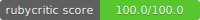

# Serenity

Los propietarios de peluquerías y salones de belleza tienen una baja cultura de autocontrol, combinan las cuentas del negocio con las personales y realizan la mayoría de las operaciones de forma manual (papel-cuaderno), lo que genera lentitud, datos inexactos y escasa información para toma de decisiones.

## Sprint Leader

| Sprint 1 | Sprint 2 | Sprint 3 | Sprint 4 | Sprint 5 | Sprint 6 | Sprint 7 | Sprint 8 |
|---|---|---|---|---|---|---|---|
| Diego | Juan | Edward | Alex | Juan | Diego |

## Solución

Sistema de gestión para peluquerías, barberías y salones de belleza. Solución Software as a Service, que permite a los gerentes agilizar las operaciones básicas de negocio y calcular métricas para mejorar la experiencia de sus clientes.

## Historias de usuario y requerimientos funcionales

> Como **Administrador del sistema**, quiero configurar mi salón y definir reglas operacionales. 

- [x]	Crear negocio o salón
- [x]	Administrar productos y/o servicios
- [x] Gestionar colaboradores
- [x]	Establecer canones o comisiones

> Como **Cajero**, necesito facturar en menos de un minuto para evitar fatiga en los clientes.

- [x]	Asignar cliente a factura
- [x]	Asignar productos a factura
- [x]	Asignación de colaborador x cada item
- [ ]	calcular totales y subtotales
- [ ]	Definir metodo de pago 
- [ ]	Permitir pagos de contado y a crédito

> Como **Cajero**, requiero añadir préstamos y anticipos entregados a colaboradores, para que sean descontados al realizar la nómina.

- [x] Multas
- [x] Descuentos
- [x] Préstamos

> Como **Cajero**, necesito disponer de los saldos de deudores, para realizar cobros en términos de vencimiento y exactitud.

- [ ]	Registrar pagos de cuentas por cobrar
- [ ]	Ver facturas pendientes x cliente
- [ ]	Realizar pago total del saldo
- [ ]	Realizar pagos parciales por factura

> Como **Propietario de negocio**, necesito acceder a informes, para saber si mi negocio es rentable.

- [ ]	Ventas x día, Ventas x mes
- [ ] Gastos x día, Gastos x mes
- [ ]	Top clientes, clientes con mayor facturación media
- [ ]	Total de comisiones x semana
- [ ]	Informe Caja (Efectivo vs tarjetas y otros medios)
- [ ]	Informe de Cartera (Total deudores)

> Como **Propietario de negocio**, necesito llevar un registro de las ventas	y deducciones del personal para calcular el canon a pagar de los estilistas.

- [ ]	Remuneración x comisiones
- [ ]	Remuneración x Fija
- [ ]	Remuneración mixta

## Requerimientos no funcionales

- [x] Despliegue en la nube (Heroku, Google, Azure, Amazon)
- [x] Base de datos Postgres
- [x] Diseño responsivo
- [x] Ruby on rails 7
- [x] Utilizar SandiMeter para analizar el código y refactorizar el código
- [x] Puntuación en Rubycritic 90 en la carpeta de la App y al menos 65 en las pruebas
- [ ] Pruebas unitarias (TDD) 

## Plan de ejecución

> Instrucciones:*considerando que el tiempo que tienen para desarrollar el proyecto es relativamente corto, es importante elaborar una planeación que permita dimensionar el máximo avance posible. 

- [Ver el plan de ejecución](inserta aquí el enlace a tu documento)

## Diseño de UI
> Instrucciones: *inserta el enlace a el diseño de UI de tu proyecto. Asegúrate de que todos tengan permisos para el acceso.*

- [Ver diseño de UI]()

## Recursos

- [Minimum Viable Product](https://www.agilealliance.org/glossary/mvp/#q=~(infinite~false~filters~(tags~(~'mvp))~searchTerm~'~sort~false~sortDirection~'asc~page~1))
- [Minimum Viable Product (MVP)](https://www.productplan.com/glossary/minimum-viable-product/)
- [Design Thinking](https://www.interaction-design.org/literature/topics/design-thinking)
- [El proceso de pensamiento de diseño](https://www.youtube.com/watch?v=_r0VX-aU_T8)
- [Metodología Design Thinking. Ejemplos](https://www.youtube.com/watch?v=_ul3wfKss58)
- [Design Thinking ejemplo sencillo](https://www.youtube.com/watch?v=_H33tA2-j0s)
